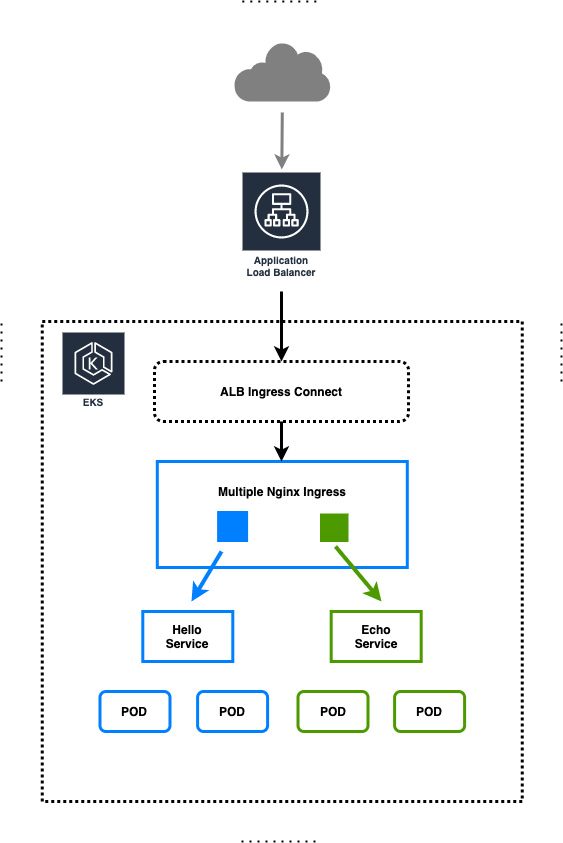

# Implementation of an ALB with Multiple Nginx Ingress on EKS Cluster

Documentation / Steps to create ALB with Multiple Nginx Ingress/Service on EKS Cluster. 



## Create Cluster for Demo

```
eksctl create cluster -f cluster.yaml --kubeconfig kubeconfig
```

## Install ALB Ingress
To Create ALB Ingress on EKS use the below AWS Docs: <br>
https://docs.aws.amazon.com/eks/latest/userguide/alb-ingress.html

> Note: Follow the steps till installation, no need to deploy sample app.

## Install Nginx Ingress
To Create Nginx Ingress on EKS use the below Helm Chart: <br>
https://github.com/kubernetes/ingress-nginx/

To install, we will add the helm repository to the cluster and update: <br>
You can choose the repository name you want.
```
helm repo add <repository_name> https://kubernetes.github.io/ingress-nginx
helm repo update
```
> Note: Helm 3 Supported

### Install Chart
Now, we can install the helm chart with the following command:

```
helm install nginx-ingress ingress-nginx/ingress-nginx --set-string controller.service.externalTrafficPolicy=Local --set-string controller.service.type=NodePort --set controller.publishService.enabled=true --set serviceAccount.create=true --set rbac.create=true --set-string controller.config.server-tokens=false --set-string controller.config.use-proxy-protocol=false --set-string controller.config.compute-full-forwarded-for=true --set-string controller.config.use-forwarded-headers=true --set controller.metrics.enabled=true --set controller.autoscaling.maxReplicas=1 --set controller.autoscaling.minReplicas=1 --set controller.autoscaling.enabled=true --namespace kube-system
```

> Note: Important variable is to set Nginx Ingress Controller Service as NodePort not a ClusterIP Service.

## Connect the ALB to the Nginx Ingress Controller

To connect the ALB to the Nginx Ingress Controller, we need to create a Kubernetes ingress resource in the namespace kube-system with the following configuration:

Create a connection YAML file and apply. 

```
kubectl apply -f alb_ingress_connect.yaml
```

In this file, change <SUBNETS_LIST> and <NGINX_INGRESS_CONTROLLER_SERVICE_NAME>.

```
apiVersion: extensions/v1beta1 
kind: Ingress 
metadata: 
  annotations: 
    #alb.ingress.kubernetes.io/certificate-arn: <CERTIFICATE_ARN> 
    alb.ingress.kubernetes.io/healthcheck-path: /healthz 
    alb.ingress.kubernetes.io/scheme: internet-facing 
    alb.ingress.kubernetes.io/subnets: <SUBNETS_LIST>
    kubernetes.io/ingress.class: alb  
  name: alb-ingress-connect-nginx 
  namespace: kube-system 
spec: 
  rules: 
    - http: 
        paths: 
          - backend: 
              serviceName: <NGINX_INGRESS_CONTROLLER_SERVICE_NAME> 
              servicePort: 80
            path: /* 
```
We just deployed an ALB Ingress which forwards the traffic from ALB to the Nginx Ingress Controller. 

Validate the deployment by accessing the ingress address, it will be public facing DNS address
```
kubectl get ingress -n kube-system
```

Congratulations, We have now deployed both ALB and Nginx Ingress Controller on EKS Cluster. And is ready to be use. We can test the using sample deployment!!!

> Note: Deploy your application with following ingress annotation and service port should be 'ClusterIP'
```
annotations:
   kubernetes.io/ingress.class: nginx
```

## Deploy Sample Application
```
kubectl apply -f echo.yaml  
kubectl apply -f hello.yaml  
```

